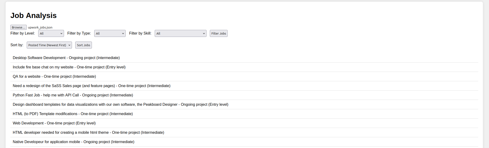

# Mini Project 3: Upwork Jobs Analysis

The Job Analysis Project involves analyzing job data from a JSON file, implementing filtering and sorting functionality on a webpage to help users easily explore job listings. The project aims to build a comprehensive user interface that allows for interactive data exploration, including filtering by job attributes and sorting job listings. This will give you practical experience in working with JSON data, JavaScript, and DOM manipulation.

## Basic Requirements

1. **HTML Layout**: Create a well-structured HTML page that provides an intuitive user interface for users to upload data, filter job listings, and apply sorting. The layout should include an input element for file uploads, filter forms for different criteria, and a display area for job listings. Ensure the page is styled appropriately for easy navigation.

2. **Data Loading**: The webpage should allow users to load job data from a JSON file. The data must be properly parsed, and any errors during loading should be handled gracefully, ensuring the program doesn't crash. Users will first browse and upload the JSON file containing job listings, after which the job data will be displayed in a list format. **Note: Due to browser security restrictions, JavaScript cannot directly access local files without user interaction. Therefore, users must manually select and upload the JSON file; attempting to directly load local files via JavaScript will not work.**

3. **Job Class Definition**: Define a `Job` class to encapsulate the details of each job entry, such as title, posted time, type, level, skill, and detail. Use JavaScript to create methods for retrieving and formatting job details.

4. **Filtering Functionality**: Implement filtering functionality that allows users to filter jobs based on criteria such as job `Level`, `Type`, and `Skill`. The filtering options should be generated based on the available data. As users select different filters, the job listing will be updated to reflect only those jobs that match the selected criteria.

5. **Sorting Functionality**: Provide sorting options to allow users to sort job listings by title or by posted time, ensuring that time values are standardized for correct sorting.

6. **Error Handling**: Ensure the application handles incomplete or incorrect data gracefully, providing informative error messages without crashing.

7. **Interactive Job Details**: Users can click on each job listing to view more detailed information about the job, including attributes such as title, type, level, skill, and detail. This ensures users can easily access all relevant information for a given job.

## Grading Criteria

### Functional Requirements and Points Allocation

### 1. HTML Layout and User Interface (1 Point)

- **Knowledge Points**: HTML structure, CSS styling, basic UI design.
  - **Proper HTML Layout (1 Point)**: Ensure a well-structured HTML layout to display job data and interactive elements such as filtering and sorting dropdowns. The webpage should provide an intuitive user interface that is easy to navigate. The page should include an input element to load data, filter forms, and a section to display job listings.

### 2. Load Jobs Data from JSON File (1 Point)

- **Knowledge Points**: File handling, JSON parsing.
  - **File Input Handling and Data Loading (1 Point)**: The project should allow the user to select a JSON file via an `<input type="file">` element. The file should be read using a `FileReader` to parse the JSON data and create Job objects. Implement error handling to ensure that if the file is missing or the format is incorrect, an appropriate error message is displayed.

### 3. Define and Use a `Job` Class (1 Point)

- **Knowledge Points**: Object-oriented programming, constructors.
  - **Job Class Creation (1 Point)**: The `Job` class should encapsulate all relevant job details, including title, posted time, type, level, skill, and detail. The class should have a constructor and methods to provide detailed information about each job. Ensure that the `Job` class provides methods for retrieving formatted details and creating job instances from data.

### 4. Filtering Functionality (2 Points)

- **Knowledge Points**: Array methods (`filter`), DOM manipulation.
  - **Filter by Criteria (1 Point)**: Implement filtering options that allow users to filter jobs based on `Level`, `Type`, or `Skill`. Use the `filter` method to achieve this.
  - **Dropdown Generation (1 Point)**: Generate dropdown options  based on the available job data, ensuring that users only see relevant filtering options. Use `Set` to collect unique filter values and update the dropdown menus.

### 5. Sorting Functionality (2 Points)

- **Knowledge Points**: Array methods (`sort`), data normalization.
  - **Sort by Title (1 Point)**: Implement a sorting option that allows users to sort jobs alphabetically by title (A-Z and Z-A). Use the `sort` method to achieve this.
  - **Sort by Posted Time with Normalization (1 Point)**: Implement a sorting option that allows users to sort jobs by posted time (oldest first and newest first). Convert the "Posted" field into a unified time format (e.g., minutes) for easier comparison.

### 6. Error Handling and Edge Cases (1 Point)

- **Knowledge Points**: Error handling, robustness.
  - **Error Handling (1 Point)**: Add error handling logic to manage data anomalies (e.g., missing fields) during the data loading and processing phases. Ensure that the program handles incomplete or incorrect data gracefully, displaying relevant error messages without crashing the application.

## Total Points: 8

The grading will be based on the successful implementation of each feature as described above, with an emphasis on the underlying skills and concepts required for each functionality. Proper usage of JavaScript, understanding of DOM manipulation, object-oriented programming, and good coding practices are essential for achieving a high score on this project.

## Submission Requirements
1. Push code files containing the required functionality to your repository.
2. Publish the index.html file as done in Tutorial 1, and submit the link to your repository on OWL. 
3. We recommend separating your JavaScript code and HTML code for better clarity and maintainability. 
